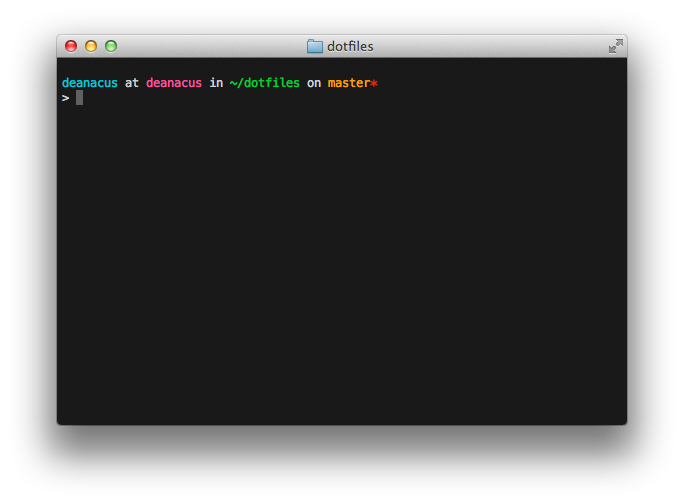

# Dotfiles

Just another dotfiles repo.

I don't spend a whole lot of time on the command line but when I do I want it to work for me, not the other way around.

##Installation: 

	git clone git://github.com/deanacus/dotfiles ~/dotfiles
	cd ~/dotfiles
	./dotfiles.sh push

### Screenshot:
